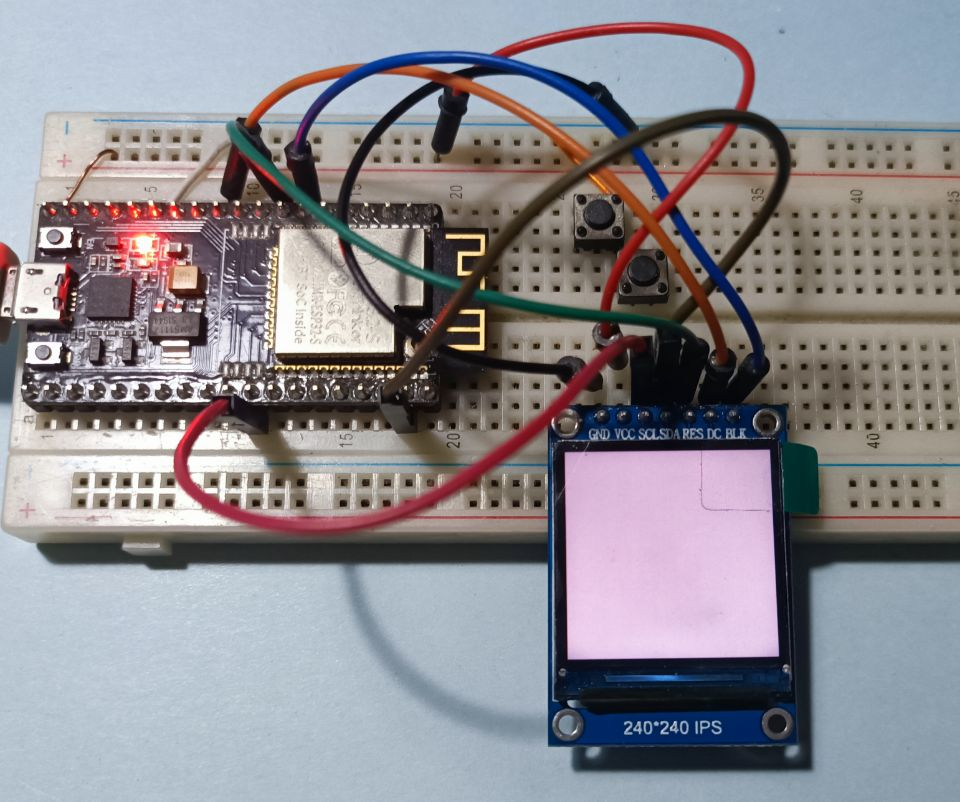
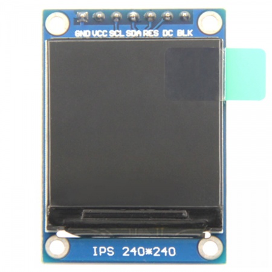

# ESP32驱动1.3寸IPS屏

修改自[gitee:菜大毛/KEY_ESP32](https://gitee.com/caidamao/key_-esp32.git) 对应B站教程[lvgl8学习笔记：2.基于ST7789芯片的1.54寸LCD屏幕驱动 spi方式（上）](https://www.bilibili.com/video/BV1G44y187aH)

我手上的板子是[ESP-32S](https://docs.ai-thinker.com/esp32/boards/nodemcu_32s)屏幕是[1.3inch IPS Module](http://www.lcdwiki.com/zh/1.3inch_IPS_Module)，原例子跑不起来，修改了部分代码。



## 代码修改


1. `components\user_dev\SPI\User_dev_spi.c`
```c
static const spi_device_interface_config_t devcfg = {
    .clock_speed_hz = SPI_MASTER_FREQ_40M,
    // 修改为模式2
    .mode = 2,
    .spics_io_num   = PIN_NUM_CS,
    .queue_size = 7
};
```

2. `components\user_dev\SPI\User_dev_spi.h`

```c
#define PIN_NUM_CLK  18
// 1.3寸屏没有引出CS引脚
#define PIN_NUM_CS -1
```

3. `components\user_mid\User_mid_LCD.h`
```c
// 修改了控制引脚
#define LCD_RES GPIO_NUM_33
#define LCD_DC GPIO_NUM_27
#define LCD_BLK GPIO_NUM_32

```

## 屏幕信息

[1.3inch IPS Module](http://www.lcdwiki.com/zh/1.3inch_IPS_Module)




### 引脚定义

|序号|模块引脚|引脚说明|
|-|-|-|
|1|GND|液晶屏电源地|
|2|VCC|液晶屏电源正(3.3V)|
|3|SCL|液晶屏SPI总线时钟信号|
|4|SDA|液晶屏SPI总线写数据信号|
|5|RES|液晶屏复位控制信号（低电平复位）|
|6|DC|液晶屏寄存器/数据选择控制信号（低电平：寄存器，高电平：数据）|
|7|BLK|液晶屏背光控制信号（高电平点亮，如不需要控制，请接3.3V）|
### 参数
|名称|参数|
|-|-|
|显示颜色|RGB 65K 彩色|
|SKU|MSP1308|
|尺寸|1.3(inch)|
|面板材质|TFT|
|驱动芯片|ST7789|
|分辨率|240*240 (Pixel)|
|显示接口|4-line SPI interface|
|有效显示区域(AA区)|23.40x23.40 (mm)|
|触摸屏类型|无触摸屏|
|触摸IC|无触摸IC|
|模块PCB底板尺寸|39.22x27.78 (mm)|
|视角|全角度|
|工作温度|-10℃~60℃|
|存储温度|-20℃~70℃|
|工作电压|3.3V|
|功耗|待定|
|产品重量（含包装）|9g|


